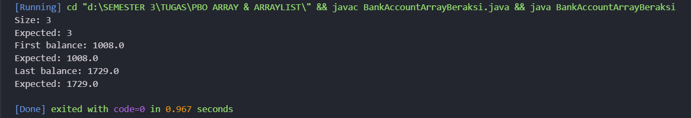
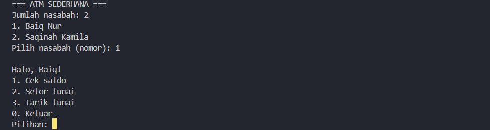
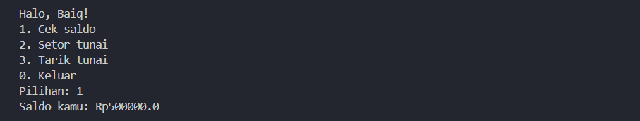
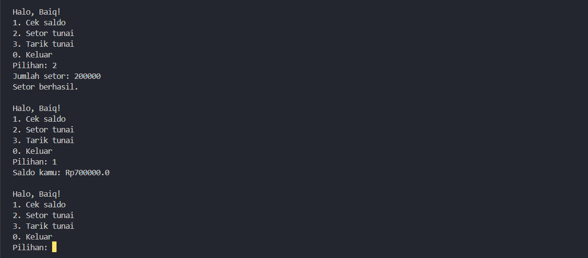
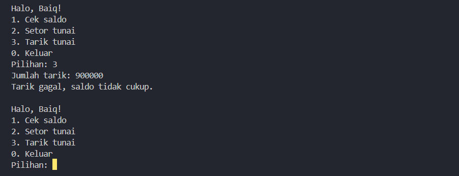

# Latihan PBO 4 - Array dan ArrayList

Tugas **3B - Latihan/Eksplorasi Materi Array dan ArrayList**
Mata Kuliah Pemrograman Berorientasi Objek (PBO)
Teknik Informatika, Universitas Mataram

## Identitas

| | |
|---|---|
| **NIM** | F1D02510042 |
| **Nama** | BAIQ NUR SAQINAH KAMILA |
| **Kelas** | 3B |

---

## Deskripsi Singkat

Repositori ini berisi hasil latihan materi **Array** dan **ArrayList** pada Java.
Latihan mencakup:

1. Operasi dasar `ArrayList` (add, insert, remove, get)
2. Kelas `Account`, `Customer`, dan `Bank` sebagai studi kasus perbankan sederhana
3. Menu ATM sederhana menggunakan `java.util.Scanner`

---

## Struktur Repositori

```
latihan-array/
├── Account.java
├── Customer.java
├── Bank.java
├── Main.java
├── BankAccountArrayBeraksi.java
├── README.md
└── screenshots/
    ├── beraksi.png
    ├── atm-menu.png
    ├── atm-cek-saldo.png
    ├── atm-setor.png
    └── atm-tarik-gagal.png
```

## Daftar File

| File | Keterangan |
|------|------------|
| `Account.java` | Kelas rekening: menyimpan saldo, dengan method `getBalance()`, `deposit()`, `withdraw()` |
| `Customer.java` | Kelas nasabah: menyimpan nama dan daftar rekening menggunakan `ArrayList<Account>` |
| `Bank.java` | Kelas bank: menyimpan daftar nasabah menggunakan array `Customer[]` |
| `Main.java` | Program utama berisi menu ATM sederhana |
| `BankAccountArrayBeraksi.java` | Latihan `ArrayList` dengan objek `Account` |

---

## Library Tambahan

Tidak ada library eksternal. Program hanya memakai library bawaan Java:

- `java.util.Scanner` untuk membaca input dari keyboard
- `java.util.ArrayList` untuk menyimpan daftar objek

## Cara Menjalankan

**Prasyarat:**
- JDK sudah terpasang (cek dengan `java -version` dan `javac -version`)
- Visual Studio Code dengan ekstensi **Extension Pack for Java**

**Langkah di VS Code:**

1. Clone repositori ini atau unduh sebagai ZIP, lalu ekstrak.

   ```bash
   git clone https://github.com/username/nama-repo.git
   ```

2. Buka folder proyek di VS Code: **File → Open Folder**, lalu pilih folder repositori.
3. Buka Terminal bawaan VS Code dengan `` Ctrl + ` `` (atau menu **Terminal → New Terminal**).
4. Pastikan terminal berada di folder proyek. Jika belum, masuk dengan `cd`.

   ```bash
   cd "path/ke/folder/proyek"
   ```

5. Compile semua file.

   ```bash
   javac *.java
   ```

6. Jalankan program yang diinginkan.

   ```bash
   java Main
   java BankAccountArrayBeraksi
   ```

> **Catatan:** Program `Main` meminta input dari keyboard (`Scanner`). Jalankan lewat **Terminal**,
> bukan panel **Output**, karena panel Output bersifat *read-only* dan tidak bisa menerima input.
> Jika memakai ekstensi Code Runner, aktifkan `code-runner.runInTerminal` di Settings.

---

## Hasil dan Penjelasan

### 1. BankAccountArrayBeraksi (ArrayList)



**Penjelasan:**
Program membuat `ArrayList<Account>`, lalu menjalankan operasi berikut:

| Langkah | Operasi | Isi list (saldo) |
|---|---|---|
| 1 | `add` 3 rekening (1001, 1015, 1729) | [1001, 1015, 1729] |
| 2 | `add(1, ...)` rekening 1008 di indeks 1 | [1001, 1008, 1015, 1729] |
| 3 | `remove(0)` | [1008, 1015, 1729] |

Setelah itu program menampilkan ukuran list (`size()`), elemen pertama, dan elemen terakhir.
Hasilnya sesuai nilai *Expected* pada soal.

**Contoh output:**

```
Size: 3
Expected: 3
First balance: 1008.0
Expected: 1008.0
Last balance: 1729.0
Expected: 1729.0
```

---

### 2. Menu ATM Sederhana

#### a. Daftar nasabah dan menu utama



**Penjelasan:**
Saat program dijalankan, `Main` membuat objek `Bank` lalu menambahkan 2 nasabah
(Baiq Nur dan Saqinah Kamila), masing-masing dengan satu rekening.
Daftar nasabah dicetak dengan perulangan `for`, lalu pengguna memilih nasabah
berdasarkan nomor. Setelah itu menu ATM ditampilkan berulang dengan `do-while`
sampai pengguna memilih `0` (keluar).

#### b. Cek saldo



**Penjelasan:**
Menu `1` memanggil `getBalance()` pada objek `Account` milik nasabah yang dipilih.

#### c. Setor tunai



**Penjelasan:**
Menu `2` memanggil `deposit(jumlah)`. Method ini mengembalikan `true` dan menambah saldo
hanya jika jumlah lebih dari 0. Jika tidak, program menampilkan pesan gagal.

#### d. Tarik tunai (gagal karena saldo tidak cukup)



**Penjelasan:**
Menu `3` memanggil `withdraw(jumlah)`. Method ini hanya berhasil jika saldo mencukupi.
Jika jumlah penarikan lebih besar dari saldo, saldo tidak berubah dan program menampilkan
pesan "Tarik gagal, saldo tidak cukup."

**Contoh alur:**

```
=== ATM SEDERHANA ===
Jumlah nasabah: 2
1. Baiq Nur
2. Saqinah Kamila
Pilih nasabah (nomor): 1

Halo, Baiq!
1. Cek saldo
2. Setor tunai
3. Tarik tunai
0. Keluar
Pilihan: 1
Saldo kamu: Rp500000.0
```

---

## Konsep yang Dipelajari

| Konsep | Penerapan di program |
|---|---|
| Array 1 dimensi | `Customer[]` pada kelas `Bank` |
| `ArrayList` | `ArrayList<Account>` pada `Customer` dan `BankAccountArrayBeraksi` |
| Enkapsulasi | Atribut `private` dengan getter dan method pengubah |
| Validasi input | `deposit()` dan `withdraw()` mengembalikan `boolean` |
| Perulangan | `for` dan `do-while` pada menu ATM |

## Catatan

- `Customer` memakai `ArrayList` karena jumlah rekening bisa bertambah.
- `Bank` memakai array biasa dengan kapasitas 10 nasabah.
